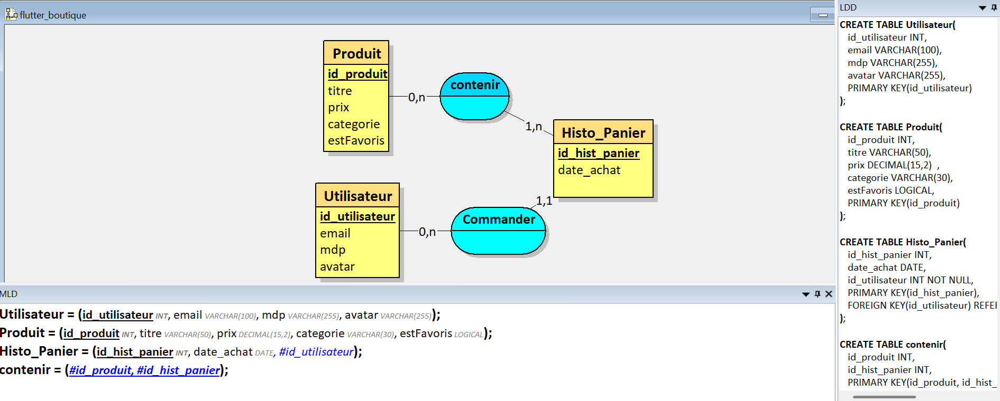

# 🛒 My Restaurant - Boutique Flutter (Projet BLOC 2)

> `**Note du Chef :** Développé par un expert de *My Restaurant* sur Roblox, mais un pur **Noob** en Flutter (pour l'instant).`



## 🎯 Vision du Projet
Ce projet est une application de E-commerce développée avec Flutter. L'objectif est de passer du statut de **Noob** à celui de Pro en alliant une interface fluide à une architecture solide, en suivant la méthodologie **TDD (Test Driven Development)** et les principes du **Clean Code**.

---

## 🏗️ Architecture & Organisation (Qui fait quoi ?)

Pour maîtriser le flux de données, nous utilisons l'analogie d'un **Restaurant** (concept que notre Noob maîtrise mieux sur Roblox que dans VS Code) :

| Fichier | Emplacement | Rôle (Analogie) | Pourquoi c'est important ? |
| :--- | :--- | :--- | :--- |
| **main.dart** | `lib/` | **Le Directeur** | Il vérifie les clés du resto (`.env`) et lance l'ouverture. |
| **product.dart** | `lib/models/` | **La Fiche Technique** | Définit ce qu'est un "Plat" (nom, prix, photo). |
| **cart_item.dart** | `lib/models/` | **Le Bon de Commande** | Associe un plat à une quantité précise. |
| **api_service.dart** | `lib/services/` | **Le Fournisseur** | Il fait le trajet jusqu'à l'entrepôt (API) pour ramener les produits. |
| **cart_service.dart**| `lib/services/` | **Le Serveur / La Caisse**| Garde en mémoire ce que le client a choisi. |
| **home_screen.dart** | `lib/screens/` | **Le Menu / La Salle** | Affiche la liste des plats une fois livrés. |
| **cart_screen.dart** | `lib/screens/` | **L'Addition / Le Panier** | Affiche le récapitulatif et calcule le total final. |

---

## 🍽️ Concept : My Restaurant (Logique du Code)

* **Models (`lib/models`)** : Les recettes. Même un **Noob** sait qu'on ne fait pas de burger sans pain.
* **Services (`lib/services`)** : Le personnel qui bosse en cuisine et à la caisse.
* **Supabase** : Le coffre-fort du resto (données clients et commandes).
* **Screens (`lib/screens`)** : La décoration et les tables où s'assoient les clients.

---

## 🛠️ État d'avancement du Chantier (Spécial Noob)

### ✅ Étape 0 : Infrastructure (Fait)
- [x] Setup du projet Flutter et intégration `supabase_flutter`.
- [x] Configuration du `main.dart` (Chargement `.env` et Router).

### ✅ Étape 1 : Modélisation & Qualité (Fait)
- [x] **Model (product.dart)** : Création du moule avec factory `fromJson`.
- [x] **TDD** : Mise en place des tests pour prouver qu'on n'est plus totalement un noob.

### ✅ Étape 2 : Services & Flux (Fait)
- [x] **ApiService** : Récupération des données réelles depuis Platzi API.
- [x] **Gestion du Panier** : Le `CartService` (Singleton) gère enfin les commandes.
- [x] **Navigation** : On peut enfin aller à la caisse (CartScreen).

### ⏳ Étape 3 : Finalisation (À venir)
- [ ] **Suppression** : Apprendre à jeter les plats brûlés (Supprimer du panier).
- [ ] **Persistence** : Garder les données même après la fermeture du resto.

---

## 📚 Dictionnaire du Noob (Récapitulatif)

| Mot-clé | Analogie Restaurant | Ce que ça fait vraiment |
| :--- | :--- | :--- |
| **Static** | Mémoire du serveur | Variable partagée, accessible partout sans recréer d'objet. |
| **Navigator** | La porte entre la salle et la caisse | Gère le passage (`push/pop`) d'un écran à un autre. |
| **Ternaire (`? :`)** | "Il reste du rab ?" | Affiche un widget différent selon une condition (ex: Panier vide). |
| **Expanded** | Table à rallonge | Force un widget à prendre toute la place disponible. |
| **factory** | Traducteur de commande | Transforme du JSON brut en bel objet Dart. |

---

## 🧪 Qualité & Tests
Même si tu es un expert Roblox, ici on teste pour ne pas passer pour un noob :
```bash
flutter test
