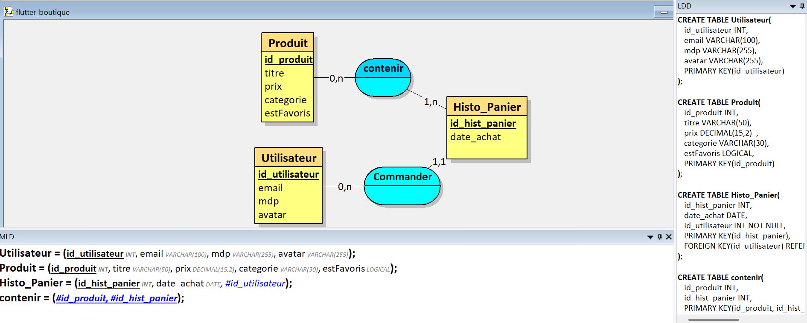

# 🛒 My Restaurant - Boutique Flutter (Projet BLOC 2)

> **Note du Chef :** Développé par un expert de *My Restaurant* sur Roblox, mais un pur Noob en Flutter (pour l'instant). On progresse vers le grade d'Architecte !



---

## 🎯 Vision du Projet

Ce projet est une application de **E-commerce** développée avec **Flutter**. L'objectif est de passer du statut de Noob à celui de Pro en alliant une interface fluide à une architecture solide, en suivant la méthodologie **TDD** (Test Driven Development) et les principes du **Clean Code**.

---

## 🏗️ Architecture & Organisation (Qui fait quoi ?)

Pour maîtriser le flux de données, nous utilisons l'analogie d'un **Restaurant** :

| Fichier | Emplacement | Rôle (Analogie) | Responsabilité |
| :--- | :--- | :--- | :--- |
| `main.dart` | `lib/` | **Le Directeur** | Vérifie les clés du resto (`.env`), configure les Providers et lance l'ouverture |
| `product.dart` | `lib/models/` | **La Fiche Technique** | Définit la structure d'un "Plat" (nom, prix, photo) |
| `cart_item.dart` | `lib/models/` | **Le Bon de Commande** | Associe un plat à une quantité précise |
| `cart_provider.dart` | `lib/providers/` | **Le Maître d'Hôtel** | Notifie automatiquement la salle quand le panier change |
| `api_service.dart` | `lib/services/` | **Le Fournisseur** | Récupère les produits depuis l'API distante (entrepôt) |
| `cart_service.dart` | `lib/services/` | **Le Serveur** | Gère en mémoire les choix du client avec logique de regroupement |
| `home_screen.dart` | `lib/screens/` | **Le Menu** | Affiche la liste des plats disponibles |
| `cart_screen.dart` | `lib/screens/` | **L'Addition** | Affiche le récapitulatif et calcule le total |
| `.env` | **Racine** | **Le Garde-fou** | Contient les clés secrètes pour Supabase (🔒 privé) |

---

## 🍽️ Concept : My Restaurant (Logique du Code)

- **Models** (`lib/models/`) : Les recettes. Même un Noob sait qu'on ne fait pas de burger sans pain.
- **Providers** (`lib/providers/`) : Le haut-parleur du resto. Dès qu'une commande change, il prévient tout le monde sans recharger la page.
- **Services** (`lib/services/`) : Le personnel qui bosse en cuisine pour traiter les données.
- **Supabase** : Le coffre-fort (données clients). C'est ici que la fusion entre l'app et les données opère.
- **Screens** (`lib/screens/`) : La décoration et les tables (L'interface utilisateur).

---

## 🔐 Sécurité & Configuration

L'accès à la base de données est protégé par un fichier `.env` (jamais commité).

### Exemple de fichier `.env`

```env
SUPABASE_URL=https://votre-projet.supabase.co
SUPABASE_ANON_KEY=votre-cle-api-secrete
```

⚠️ **Important :** Le fichier `.env` est listé dans `.gitignore` pour rester privé et sécurisé.

---

## 🛠️ État d'avancement du Chantier

### ✅ Étape 0 : Infrastructure
- [x] Setup du projet Flutter et intégration `supabase_flutter`
- [x] Configuration du `main.dart`

### ✅ Étape 1 : Modélisation & Qualité
- [x] Model (`product.dart`) avec `factory fromJson`
- [x] TDD : Mise en place des tests

### ✅ Étape 2 : Services & Flux
- [x] **ApiService** : Récupération des données réelles (Platzi API)
- [x] **Gestion du Panier** : Le `CartService` évite les doublons
- [x] **Navigation** : Passage entre les écrans

### ✅ Étape 2.5 : Management & Réactivité
- [x] **Provider** : Utilisation de `ChangeNotifier`
- [x] **CartItem** : Séparation Produit / Quantité

### ⏳ Étape 3 : Finalisation
- [ ] **Suppression** : Supprimer des éléments du panier
- [ ] **Persistence** : Sauvegarde dans Supabase

---

## 🧪 Qualité & Tests

Tous les tests passent avec succès ! ✅

### Lancer les tests

```bash
flutter test
```

---

## 🚀 Démarrage rapide

### Prérequis
- Flutter SDK installé (version 3.0+)
- Dart 3.0+
- Un compte Supabase

### Installation

1. **Cloner le repo**
   ```bash
   git clone https://github.com/morchid65/flutter-boutique.git
   cd flutter-boutique
   ```

2. **Installer les dépendances**
   ```bash
   flutter pub get
   ```

3. **Créer le fichier `.env`**
   ```bash
   cp .env.example .env
   # Puis éditer .env avec vos clés Supabase
   ```

4. **Lancer l'app**
   ```bash
   flutter run
   ```

---

## 📚 Ressources

- [Documentation Flutter](https://flutter.dev/docs)
- [Supabase Flutter Plugin](https://supabase.com/docs/reference/dart)
- [Provider Pattern](https://pub.dev/packages/provider)
- [TDD Best Practices](https://flutter.dev/docs/testing/unit-testing)

---

## 📝 Notes de Développement

- Respecter la structure de dossiers proposée (models, providers, services, screens)
- Écrire les tests **avant** le code (TDD)
- Utiliser des noms explicites (pas de `x`, `y`, `temp`)
- Commenter les logiques métier complexes

---

## 👨‍💼 Auteur

**morchid65** - En route vers le grade d'Architecte Flutter ! 🏆

---

**Dernière mise à jour :** 2026-05-04
